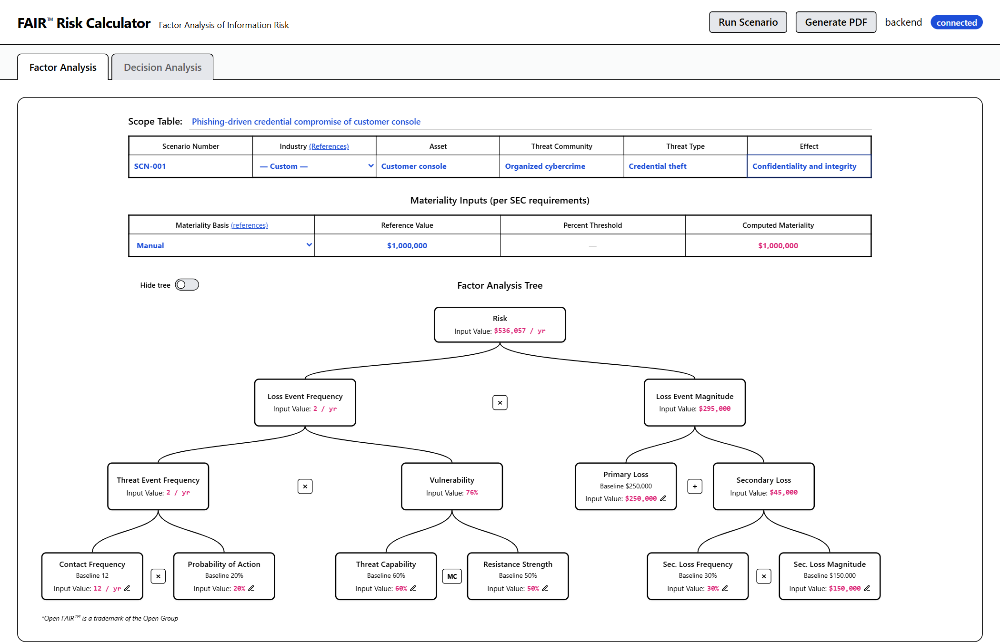
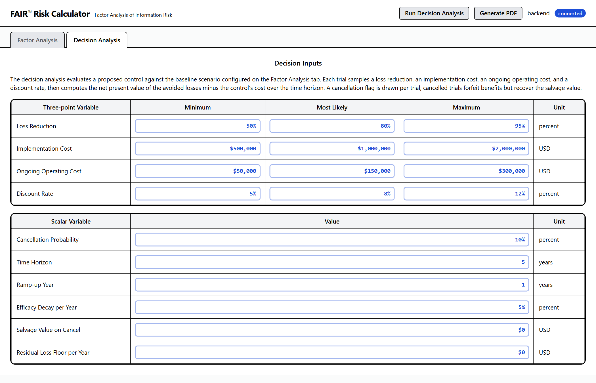
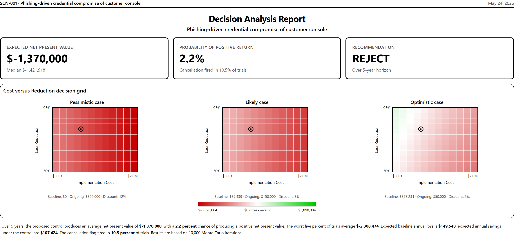
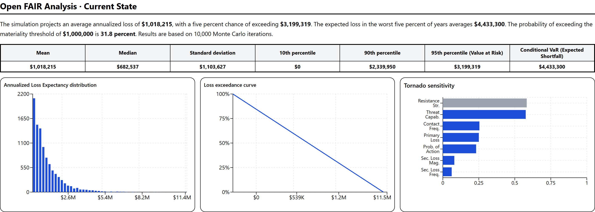

# Risk Calculator

Open FAIR™ Analysis–inspired cybersecurity risk quantification tool with an Applied Information Economics (Douglas Hubbard)–inspired decision tool.

> **Status: experimental. Not for production use.** This is a Claude Code–assisted personal project. It has not been stress-tested, calibrated, or validated against any organizational risk-management process. Do not rely on its output for live enterprise or regulatory decisions.

## Why this exists

Given limited budget and time, this project tries to satisfy two use cases for a single analyst:

1. **Analyst workspace.** A clean, simple workspace for analyzing the current state of a risk scenario and the expected return of a proposed mitigation.
2. **Executive deliverable.** A four-page, executive-ready report suitable for senior management and board decision-making, generated from the same inputs.

A note on formatting: material inputs in the user interface are bold blue; material outputs are bold pink. The printed report follows a deliberately different layout from the screen, because the two serve different audiences.

## Screenshots

> Add screenshots to `docs/screenshots/` and the markdown below will pick them up.

| On-screen Factor Analysis | On-screen Decision Analysis |
| --- | --- |
|  |  |

| Executive PDF page 1 | Executive PDF page 2 |
| --- | --- |
|  |  |

## Tech stack

Python 3.10 · Flask · NumPy · SciPy · React 18 · TypeScript · Vite · Tailwind CSS · Recharts · React Flow · Zustand.

## Quick start

You will need Python 3.10+ and Node 18+.

### Backend (Flask, port 5001)

```bash
cd risk-calculator
pip install -r src/requirements.txt
PYTHONPATH=. python -m webapp.app --port 5001
```

### Frontend (Vite, port 5000)

```bash
cd risk-calculator/frontend
npm install
npm run dev
```

Open **http://localhost:5000** in a browser. Vite proxies `/api/*` to the Flask backend automatically.

## How to use

### Factor Analysis

1. Enter the one-line fact-pattern summary in the **Scope Table:** field.
2. Complete the scope table inputs (Scenario Number, Asset, Threat Community, Threat Type, Effect).
3. Complete the Materiality Inputs table. The label reminds you that materiality disclosure is a U.S. Securities and Exchange Commission requirement for public companies.
4. Enter values that differ from the industry baseline in the Input Table. Enter your rationale for each input alongside it.
5. Click **Run Scenario** in the top-right of the page.

### Decision Analysis

1. Switch to the Decision Analysis tab.
2. Enter your three-point estimates and scalar parameters.
3. Click **Run Decision Analysis** in the top-right of the page.

Running Decision Analysis also runs the Factor Analysis simulation in parallel, so the executive report always has both halves populated from a single click.

### Generate the executive report

Click **Generate PDF** in the top-right. The browser's print dialog renders the four-page executive deliverable regardless of which tab is currently active. Sections that have no result yet display a diagonal **"Run analysis required"** watermark, so it is obvious what is still missing.

After generating the report you are ready to present to senior management and the board. Then get ready for your promotion! (Just kidding — see the status banner at the top of this document.(actually, going to repeat it here for good measure: **Status: experimental. Not for production use.** This is a Claude Code–assisted personal project. It has not been stress-tested, calibrated, or validated against any organizational risk-management process. Do not rely on its output for live enterprise or regulatory decisions.))

## Methodology

The Factor Analysis simulation samples each of the seven Open FAIR leaf inputs from a three-point (PERT) distribution, computes per-trial threat event frequency, vulnerability, loss event frequency, and loss magnitude, and aggregates to an Annualized Loss Expectancy. Sensitivity is computed by Spearman rank correlation between each input and the resulting loss.

The Decision Analysis simulation samples loss reduction, implementation cost, ongoing operating cost, and discount rate from three-point distributions. It draws a Bernoulli cancellation flag for each trial. For active trials, it builds year-by-year cashflows over the configured time horizon with ramp-up, efficacy decay, and a residual loss floor, then discounts to net present value. Cancelled trials forfeit benefits but recover salvage value.

The Cost-versus-Reduction decision grid sweeps implementation cost against loss reduction across three deterministic scenarios — pessimistic, central, and optimistic combinations of the non-axis variables — to produce a tradeoff heatmap.

## HTTP endpoints

| Endpoint | Method | Description |
| --- | --- | --- |
| `/` | GET | Web user interface |
| `/api/simulate` | POST | Run Annualized Loss Expectancy Monte Carlo |
| `/api/simulate-sle` | POST | Run a Single Loss Event simulation |
| `/api/tornado` | POST | Rank correlation of FAIR inputs against loss |
| `/api/decision` | POST | Run a Monte Carlo decision analysis |
| `/api/decision-grid` | POST | Compute three cost-versus-reduction heatmaps |
| `/api/vulnerability` | POST | Calculate vulnerability via the 21×21 grid |
| `/api/compare` | POST | Compare two scenarios |
| `/api/scenarios` | GET / POST | List or create scenarios |
| `/api/scenarios/:id` | GET / PUT / DELETE | Manage a specific scenario |

## Glossary

| Term | Meaning |
| --- | --- |
| **Annualized Loss Expectancy** | Expected dollar loss per year, integrated over frequency and magnitude. |
| **Loss Event Frequency** | Expected number of loss events per year. |
| **Threat Event Frequency** | Frequency at which a threat actor contacts and acts against the asset. |
| **Vulnerability** | Probability that a threat event becomes a loss event. |
| **Primary Loss** | Direct loss magnitude from a successful event (response, replacement, fines). |
| **Secondary Loss** | Downstream loss from stakeholder reactions (reputational, regulatory, litigation). |
| **Materiality** | Loss threshold above which a public-company event is disclosable under U.S. Securities and Exchange Commission rules. |
| **Monte Carlo iteration** | One sampled "what-if" trial; ten thousand iterations gives a stable distribution. |
| **PERT distribution** | Three-point (minimum, most likely, maximum) probability distribution used for expert estimates. |
| **Net Present Value** | Discounted sum of future cashflows; positive means the investment is worth doing in today's dollars. |

## What this tool is not

- It is not a real-time risk monitor.
- It is not integrated with a security information and event management system, a configuration database, or any threat-intelligence feed.
- It does not perform expert calibration training, although it strongly assumes you have done some.
- It is not a substitute for legal, audit, or regulatory advice on materiality determinations.
- It has not undergone independent validation.

## Opportunities for improvement

There are many, and contributions are welcome. Independent stress testing and validation, design refinements, accessibility audits, calibration helpers, and richer cancellation modelling are all on the table, plus anything you can think of (like muppets, everyone likes Elmo!).

## Resources and bibliography

The analytical methods, decision framing, and risk taxonomy used here are drawn from the following works. Citations are in American Psychological Association style.

- The Open Group. (2021). *Open FAIR™ risk analysis standard (O-RA), version 2.0*. https://www.opengroup.org/library/c20a
- Freund, J., & Jones, J. (2014). *Measuring and managing information risk: A FAIR approach*. Butterworth-Heinemann. https://www.elsevier.com/books/measuring-and-managing-information-risk/freund/978-0-12-420231-3
- Howard, R. A., & Abbas, A. E. (2015). *Foundations of decision analysis*. Pearson. https://www.pearson.com/en-us/subject-catalog/p/foundations-of-decision-analysis/P200000005899
- Hubbard, D. W. (2014). *How to measure anything: Finding the value of "intangibles" in business* (3rd ed.). Wiley. https://hubbardresearch.com/publications/how-to-measure-anything-book/
- Hubbard, D. W., & Seiersen, R. (2023). *How to measure anything in cybersecurity risk* (2nd ed.). Wiley. https://hubbardresearch.com/publications/how-to-measure-anything-in-cybersecurity-risk/
- Martin-Vegue, T. (2025). *From heatmaps to histograms: How to quantify cybersecurity risk*. Wiley. https://www.heatmapstohistograms.com/
- Mattei, M. (2024). *Data-driven cybersecurity: Decision-making in the age of artificial intelligence*. Apress. https://www.manning.com/books/data-driven-cybersecurity

Hubbard Decision Research maintains a useful set of calibration training resources, downloadable spreadsheets, and supporting publications at **https://hubbardresearch.com**.

## Acknowledgments

This project is a fork of an open call for collaborators originally posted by the upstream repository maintainer on LinkedIn. Thanks to the maintainer for hosting the call and reviewing contributions, and to the broader Open FAIR community for the underlying taxonomy.

Built with assistance from Anthropic's Claude Code.

## License

Released under the MIT License. See [LICENSE](LICENSE) for details.
